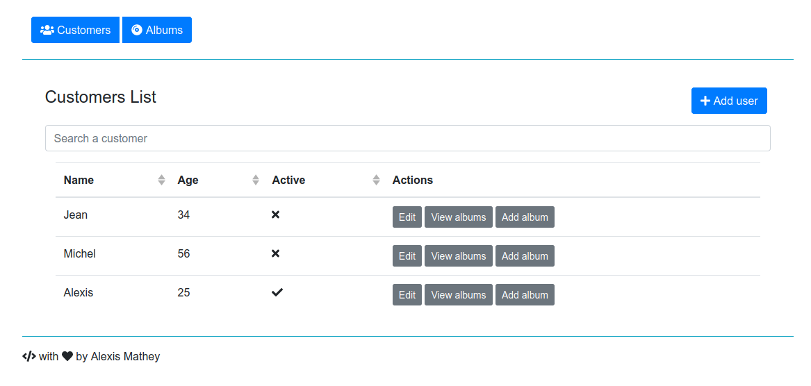
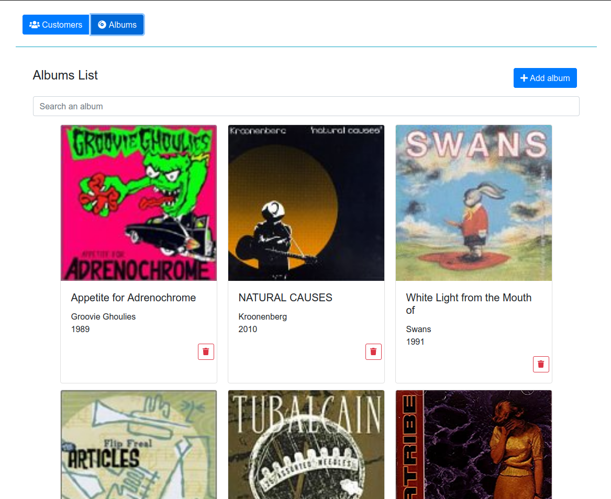
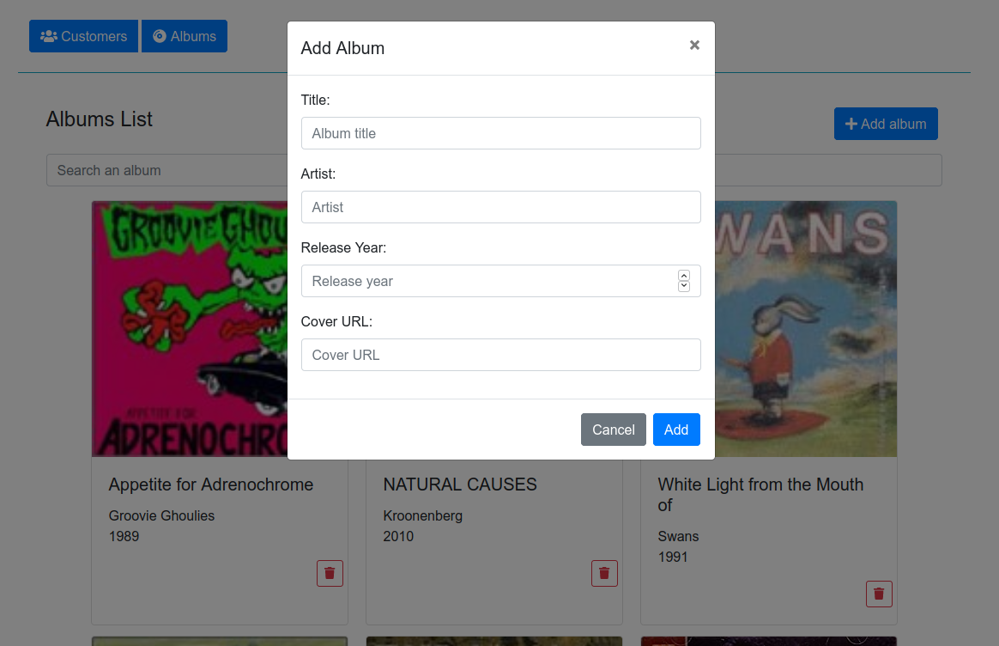
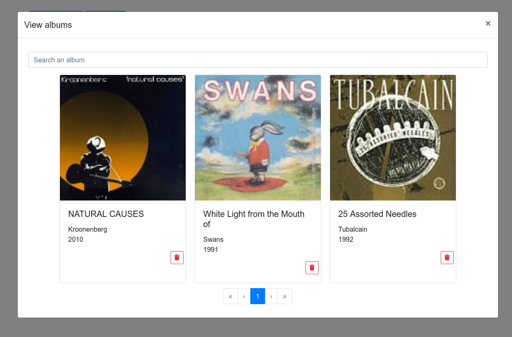

#  Predictice technical test

## Demo






## Running the project locally

### Elasticsearch

To run this project, you need a running instance of Elasticsearch. The easiest is to run it with docker:

```shell script
docker network create predictice

# Start elasticsearch
docker run -d --rm \
  --name elasticsearch \
  --network elasticsearch \
  -p 9200:9200 -p 9300:9300 \
  -e "discovery.type=single-node" \
  --mount source=elasticsearch-data,target=/usr/share/elasticsearch/data \
  docker.elastic.co/elasticsearch/elasticsearch:7.5.2
```

You can then query the instance at http://localhost:9200

> See the "Loading sample data into Elasticsearch" section below for instructions on how to load 1000 albums into your elasticsearch instance.

### Running the project from the docker image

The project has been built into a docker image that you can run as follows:

```shell script
# 1. Make sure that you run the above commands to have a running elasticsearch instance
# 2. Start the app (frontend files are served by the spring app)
docker run --network predictice \
  -v $PWD/backend-spring/application-docker.properties:/application.properties \
  -p 8080:8080 \
  amathey/predictice-test:1.0-SNAPSHOT
```

You can then access the app on port 8080 (go to http://localhost:8080 if you are running this locally).


### Local build with maven

You can also run it from the source using maven.

#### Backend

For the backend, simply run the following:
```shell script
./mvnw -pl backend-spring spring-boot:run
```

#### Frontend

For the frontend, run the following:
```shell script
cd frontend-vue
npm install
npm run dev
```

Once everything is up and running, go to http://localhost:4200/ and enjoy!

## Packaging the app

To package the app (frontend and backend), run the following:
```shell script
./mvnm package
```

This will build the frontend app and the backend app (including running unit tests) and package everything into a jar file.
This file can be found in `backend-spring/target`.

It then builds a docker image containing this jar file. At this point the image is only present locally.

To upload the image to the docker hub, you will need to run `docker login` for the target repository (by default `amathey/predictice-test`).
Once logged in, you can run:
```shell script
./mvnw -pl backend-spring dockerfile:push
```

The image is then accessible on the docker hub: https://hub.docker.com/r/amathey/predicitice-test

## Loading sample data into Elasticsearch

This app is quite boring without a decent amount of albums stored into elasticsearch.

Don't worry I've got you covered!

Once you have a local instance of elasticsearch running, simply run this from the root of the repo:
```shell script
./load-albums.py
```